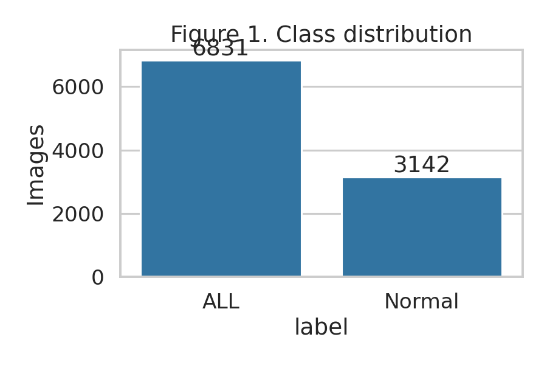
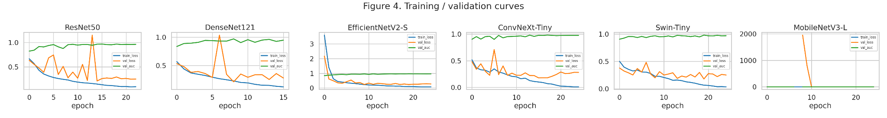
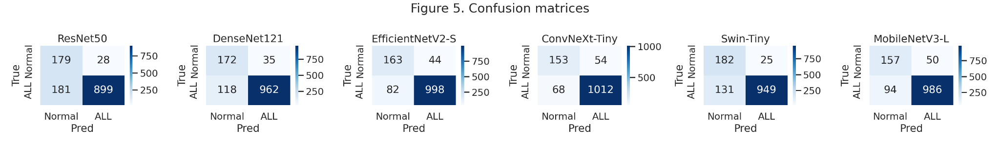
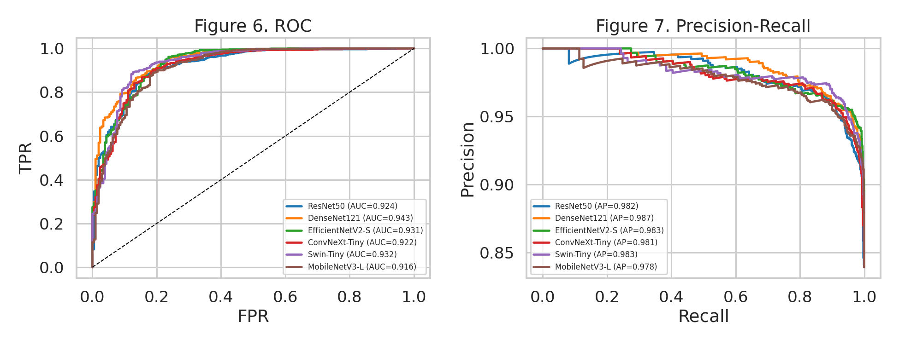
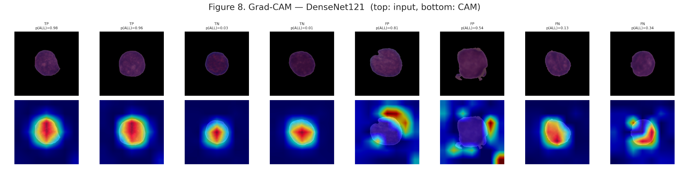
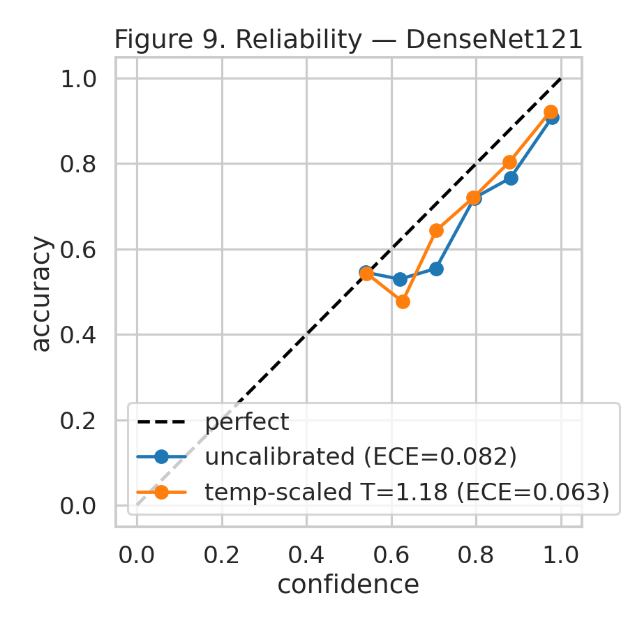
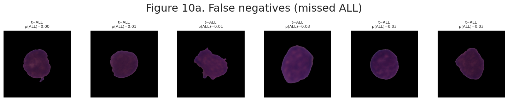
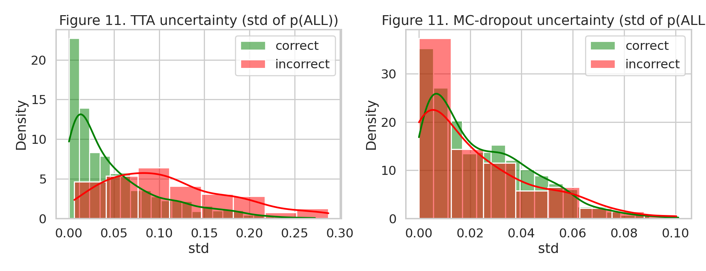

# Acute Lymphoblastic Leukemia (ALL) Detection from Microscopic Blood Cell Images

Deep-learning pipeline for binary classification of **ALL vs Normal** microscopic blood cell images. The repository includes a reproducible notebook, trained-model comparison tables, calibration and uncertainty analysis outputs, Grad-CAM explainability figures, and failure-case visualizations.

> **Clinical note:** This repository is for research and educational use only. It is not intended for diagnosis or clinical deployment without external validation, regulatory review, and expert hematopathology oversight.

## Highlights

- Dataset summary: **9973 images** from **73 patients**.
- Class balance: **6831 ALL** and **3142 Normal** images.
- Models evaluated: ResNet50, DenseNet121, EfficientNetV2-S, ConvNeXt-Tiny, Swin-Tiny, and MobileNetV3-L.
- Best ROC-AUC: **DenseNet121 = 0.943**.
- Best accuracy: **ConvNeXt-Tiny = 0.905**.
- Best F1-score: **ConvNeXt-Tiny = 0.943**.
- Calibration analysis: temperature scaling improved ECE from **0.082** to **0.063**.

## Repository structure

```text
ALL-Leukemia-Detection-Repo/
├── notebooks/
│   └── ALL_detection_pipeline.ipynb
├── results/
│   ├── figures/
│   │   ├── fig1_class_distribution.png
│   │   ├── fig4_training_validation_curves.png
│   │   ├── fig5_confusion_matrices.png
│   │   ├── fig6_7_roc_pr_curves.png
│   │   ├── fig8_gradcam_densenet121.png
│   │   ├── fig9_calibration_reliability.png
│   │   ├── fig10_failure_cases.png
│   │   └── fig11_uncertainty.png
│   └── tables/
│       ├── table1_dataset.csv
│       ├── table2_model_config.csv
│       ├── table3_model_comparison.csv
│       ├── table3b_bootstrap_ci.csv
│       ├── table4_ablation.csv
│       ├── table5a_calibration.csv
│       ├── table5b_uncertainty.csv
│       ├── table6_failure_analysis.csv
│       ├── cv_results.csv
│       └── split_record.csv
├── data/
│   └── README.md
├── docs/
│   └── results_summary.md
├── requirements.txt
├── CITATION.cff
├── LICENSE
└── .gitignore
```

## Dataset

This project is structured for the C-NMC leukemia image dataset format used in the notebook. The dataset is **not included** in this repository because medical datasets usually have their own access and redistribution terms.

Expected high-level labels:

| split   |   images |   ALL |   Normal |   patients |
|:--------|---------:|------:|---------:|-----------:|
| train   |     7599 |  4977 |     2622 |         53 |
| val     |     1087 |   774 |      313 |         11 |
| test    |     1287 |  1080 |      207 |          9 |
| total   |     9973 |  6831 |     3142 |         73 |

Before running the notebook, place the dataset in your Google Drive or local path and update the dataset path cell inside `notebooks/ALL_detection_pipeline.ipynb`.

## Main results

| model            |   accuracy |   precision |   sensitivity |   specificity |     f1 |   roc_auc |   pr_auc |   brier |    ece |
|:-----------------|-----------:|------------:|--------------:|--------------:|-------:|----------:|---------:|--------:|-------:|
| ResNet50         |     0.8376 |      0.9698 |        0.8324 |        0.8647 | 0.8959 |    0.9239 |   0.9819 |  0.1237 | 0.0705 |
| DenseNet121      |     0.8811 |      0.9649 |        0.8907 |        0.8309 | 0.9263 |    0.9426 |   0.9869 |  0.0868 | 0.0256 |
| EfficientNetV2-S |     0.9021 |      0.9578 |        0.9241 |        0.7874 | 0.9406 |    0.931  |   0.9833 |  0.078  | 0.0507 |
| ConvNeXt-Tiny    |     0.9052 |      0.9493 |        0.937  |        0.7391 | 0.9432 |    0.9222 |   0.9813 |  0.0748 | 0.038  |
| Swin-Tiny        |     0.8788 |      0.9743 |        0.8787 |        0.8792 | 0.9241 |    0.9321 |   0.9828 |  0.1008 | 0.0748 |
| MobileNetV3-L    |     0.8881 |      0.9517 |        0.913  |        0.7585 | 0.9319 |    0.916  |   0.9783 |  0.0887 | 0.0504 |

## Cross-validation ROC-AUC

|   fold |    auc |
|-------:|-------:|
|      0 | 0.9961 |
|      1 | 0.922  |
|      2 | 0.9793 |
|      3 | 0.9238 |
|      4 | 0.9302 |

## Model configuration

| model            | timm_id                      |   params_M |   size_MB |   infer_ms |
|:-----------------|:-----------------------------|-----------:|----------:|-----------:|
| ResNet50         | resnet50                     |      23.51 |      94.4 |       7.08 |
| DenseNet121      | densenet121                  |       6.96 |      28.4 |      18.57 |
| EfficientNetV2-S | tf_efficientnetv2_s          |      20.18 |      81.6 |      19.3  |
| ConvNeXt-Tiny    | convnext_tiny                |      27.82 |     111.4 |       6.46 |
| Swin-Tiny        | swin_tiny_patch4_window7_224 |      27.52 |     110.2 |      12    |
| MobileNetV3-L    | mobilenetv3_large_100        |       4.2  |      17   |       7.11 |

## Key figures

### Class distribution



### Training and validation curves



### Confusion matrices



### ROC and precision-recall curves



### Grad-CAM explainability



### Calibration



### Failure cases



### Uncertainty analysis



## How to run

### Option 1: Google Colab

1. Upload the dataset to Google Drive.
2. Upload or open `notebooks/ALL_detection_pipeline.ipynb` in Colab.
3. Set the dataset and output paths in the first configuration cells.
4. Run cells sequentially.
5. Save generated figures and CSV files to `results/` if you want to update the repository.

### Option 2: Local environment

```bash
git clone <your-repo-url>
cd ALL-Leukemia-Detection-Repo
python -m venv .venv
source .venv/bin/activate  # Windows: .venv\Scripts\activate
pip install -r requirements.txt
jupyter lab
```

Then open:

```text
notebooks/ALL_detection_pipeline.ipynb
```

## Reproducibility notes

- Keep the `split_record.csv` file for documenting image-level and patient-level split membership.
- Do not commit raw medical images unless the dataset license explicitly permits redistribution.
- Record random seeds, split strategy, augmentation settings, model checkpoints, and package versions.
- For publication-quality claims, add an external validation dataset and confidence intervals for all primary metrics.

## Limitations

- Current results are based on the available dataset split and require external validation before clinical interpretation.
- Class imbalance exists: the total dataset contains more ALL images than Normal images.
- Some false negatives are high-risk in a screening context and should be analyzed carefully.
- Grad-CAM heatmaps are qualitative and should not be treated as definitive biological explanations.

## Suggested citation

If you use this repository, cite it using the metadata in `CITATION.cff`.
